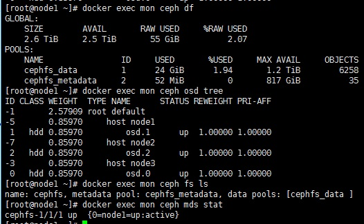

## docker iptables setup
```
cat > /etc/docker/daemon.json << EOF
{
  "insecure-registries": ["harbor.liyang.com"],
  "iptables": false
}
EOF
systemctl daemon-reload
systemctl restart docker
```
## cephfs firewall setup
```
firewall-cmd --zone=public --add-port=6789/tcp --permanent
firewall-cmd --zone=public --add-port=6800-7100/tcp --permanent
firewall-cmd --reload
firewall-cmd --list-all
```
## add Ovirt POSIX storage domain with cephfs
```
path: 192.168.100.61:/
VFS type: ceph
mountpoint option: name=admin,secret=AQDtEfFf7eEEKxAAbyL2hLnMIzIZMKtXsbWf0g==
```
## ovirt multipath.conf setup
```
blacklist{
devnode "^sdc"
}

systemctl reload multipathd
multipath -ll
```
## cephfs mount
```
ceph-authtool -p /etc/ceph/ceph.client.admin.keyring > admin.key
mount -t ceph node11:6789:/ /mnt -o name=admin,secretfile=admin.key
```

## ceph.conf
```
[global]
fsid = a7534ae3-f283-44cf-a3fc-a33b89136473
mon initial members = node1,node2,node3
mon host = 10.0.0.51,10.0.0.52,10.0.0.53
public network = 10.0.0.0/24
cluster network = 10.0.0.0/24
osd journal size = 2000
log file = /dev/null
osd pool default size = 2
mon clock drift allowed = 1
mon osd min down reporters = 3
mon osd down out interval = 600
mon allow pool delete = true

ms_type = async
ms_async_transport_type = rdma
ms_async_rdma_public_device_name = ib1
ms_async_rdma_cluster_device_name = ib1
```
## remove osd
```
docker rm -f sdd
ceph osd out 1
ceph osd crush remove osd.1
ceph auth del osd.1
ceph osd rm osd.1
```
