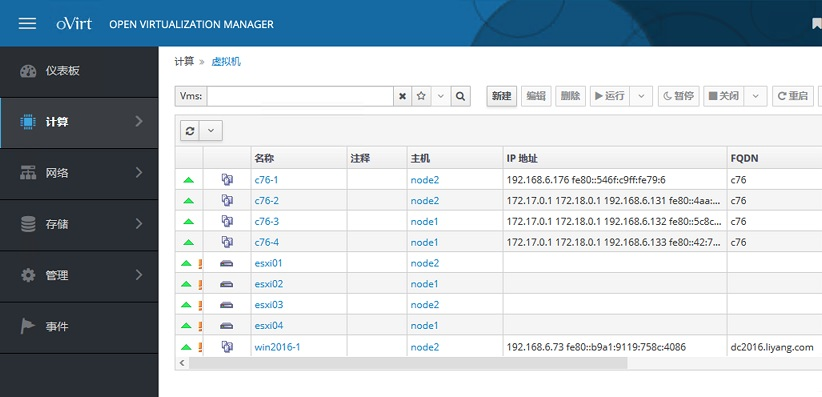
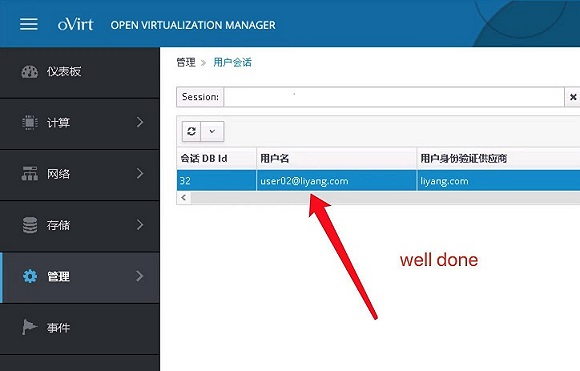

## deploy standalone ovirt-engine minimal 4G memory
```
yum -y install http://resources.ovirt.org/pub/yum-repo/ovirt-release43.rpm
tar xzvf ovirt43.tar
cat > /etc/yum.repos.d/ovirt.repo << EOF
[ovirt]
name=ovirt
baseurl=file:///root/ovirt
enabled=1
gpgcheck=0
EOF
hostnamectl set-hostname ovirt.liyang.com
cat >> /etc/hosts << EOF
192.168.6.91 c01.liyang.com
192.168.6.92 c01.liyang.com
192.168.6.64 ovirt.liyang.com
EOF
systemctl enable firewalld
systemctl start firewalld

yum -y install ovirt-engine
engine-setup --accept-defaults
engine-cleanup
```
## config ip access ovirt-engine
```
vi /etc/ovirt-engine/engine.conf.d/11-setup-sso.conf
SSO_ALTERNATE_ENGINE_FQDNS="192.168.6.63"
systemctl restart ovirt-engine
```

## Installing Cockpit on Enterprise Linux hosts
```
tar xzvf ovirt-host.tar
cat > /etc/yum.repos.d/ovirt.repo << EOF
[ovirt]
name=ovirt
baseurl=file:///root/ovirt-host
enabled=1
gpgcheck=0
EOF
yum -y install cockpit-ovirt-dashboard
systemctl enable cockpit.socket
systemctl start cockpit.socket
firewall-cmd --permanent --add-service=cockpit
firewall-cmd --reload
```
## enable nested virtualization
```
cat > /etc/modprobe.d/kvm-intel.conf << EOF
options kvm_intel nested=1
EOF
modprobe -r kvm_intel
modprobe kvm_intel
cat /sys/module/kvm_intel/parameters/nested
```
## deploy Self-hosted engine using command line
```
cat >> /etc/hosts << EOF
192.168.6.61 node1.liyang.com
192.168.6.64 engine.liyang.com
EOF

cat > /etc/yum.repos.d/ovirt.repo << EOF
[ovirt]
name=ovirt
baseurl=file:///root/ovirt-host
enabled=1
gpgcheck=0
EOF

systemctl enable firewalld
systemctl start firewalld

yum -y install ovirt-hosted-engine-setup
rpm -ivh ovirt-engine-appliance-4.3-20200319.1.el7.x86_64.rpm 
hosted-engine --deploy
```
## access https://ip:9090 to deploy self-hosted engine with cockpit
```
yum -y install cockpit-ovirt-dashboard
systemctl enable cockpit.socket
systemctl start cockpit.socket
firewall-cmd --permanent --add-service=cockpit
firewall-cmd --reload
```
## on nfs share storage host; id vdsm uid 36 gid 36
```
chown 36:36 /kvm/nfs
chmod 755 /kvm/nfs
```
## management hosted-engine
```
hosted-engine --console
hosted-engine --vm-shutdown
hosted-engine --vm-start
hosted-engine --vm-status
systemctl status -l ovirt-ha-agent
ovirt-hosted-engine-cleanup
```
## use virsh list with user passwd cat /etc/pki/vdsm/keys/libvirt_password
```
vdsm@ovirt
shibboleth
```
## management ovirt-engine on hosted-engine node
```
hosted-engine --set-maintenance --mode=global
```
## Creating a Full Backup
```
engine-backup --scope=all --mode=backup --file=ovirt.bak --log=log1
```
## Restoring a Backup to a Fresh Installation
```
engine-backup --mode=restore --file=ovirt.bak --log=log1 --provision-db --provision-dwh-db --no-restore-permissions

engine-setup
```
## on hosted-engine node
```
hosted-engine --set-maintenance --mode=none
```
## add user on ovirt-engine host
```
ovirt-aaa-jdbc-tool user add liyang \
--attribute=firstName=yang \
--attribute=lastName=li
ovirt-aaa-jdbc-tool user password-reset liyang
```
## centos7.x vm agent
```
mv agent.repo /etc/yum.repos.d/
yum -y install ovirt-guest-agent-common
systemctl enable ovirt-guest-agent
systemctl start ovirt-guest-agent
```
## join windows AD
```
yum -y install ovirt-engine-extension-aaa-ldap-setup
vi ifcfg-eth0
DNS1=WINDOWS_AD_IP
ovirt-engine-extension-aaa-ldap-setup
systemctl restart ovirt-engine
```

## Ovirt import vm from KVM
```
cat /etc/libvirt/libvirtd.conf 
listen_tls = 0
listen_tcp = 1
tcp_port = "16509"
listen_addr = "0.0.0.0"
auth_tcp = "none"

cat /etc/sysconfig/libvirtd
LIBVIRTD_CONFIG=/etc/libvirt/libvirtd.conf
LIBVIRTD_ARGS="--listen"

systemctl restart libvirtd

virsh -r -c 'qemu+tcp://192.168.6.62/system' list --all 
```
